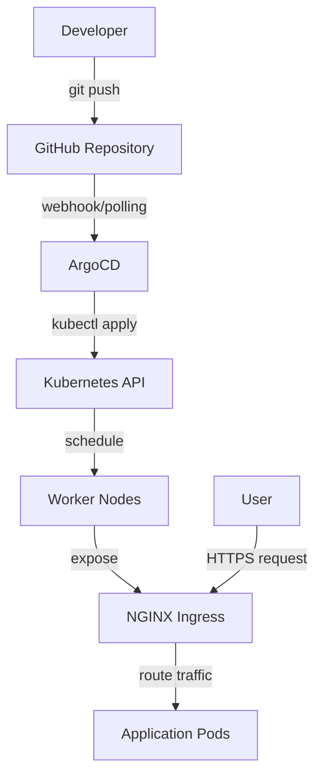
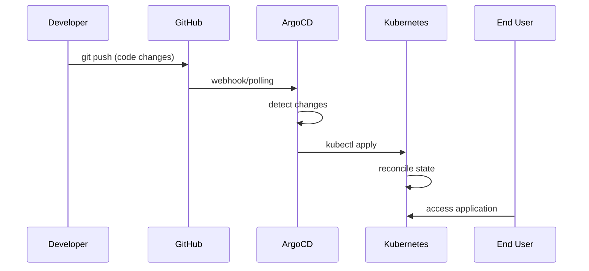

# Arquitetura do Sistema

## Visão Geral

Este projeto implementa uma arquitetura GitOps completa usando Kubernetes na AWS, onde o estado desejado da aplicação é declarado em repositórios Git e automaticamente sincronizado pelo ArgoCD.

## Componentes Principais

### 1. AWS EKS (Elastic Kubernetes Service)
- **Função**: Cluster Kubernetes gerenciado
- **Configuração**: 
  - Region: us-east-1
  - Node Type: t3.medium
  - Nodes: 2-4 (auto-scaling)
  - Network: VPC dedicada

### 2. ArgoCD
- **Função**: Continuous Deployment e GitOps
- **Características**:
  - Sync automático com Git
  - Self-healing
  - Rollback automático
  - Multi-environment support

### 3. NGINX Ingress Controller
- **Função**: Load balancing e SSL termination
- **Características**:
  - TLS/SSL certificates
  - Path-based routing
  - Rate limiting
  - AWS Load Balancer integration

### 4. Sample Application
- **Função**: Aplicação web de demonstração
- **Stack**:
  - Frontend: HTML/CSS/JS
  - Web Server: NGINX
  - Container: Alpine Linux

## Fluxo de Dados



## Estrutura do Repositório

```
k8s-gitops-demo/
├── k8s-manifests/          # Declarative Kubernetes resources
│   ├── deployment.yaml     # Application deployment
│   ├── service.yaml        # Service definition
│   ├── ingress.yaml        # Ingress rules
│   └── kustomization.yaml  # Kustomize configuration
├── argocd-apps/            # ArgoCD application definitions
│   ├── sample-app.yaml     # Main application
│   └── app-of-apps.yaml    # App of apps pattern
├── helm-charts/            # Helm charts (optional)
│   └── sample-app/         # Packaged application
└── docs/                   # Documentation
```

## Rede e Segurança

### Network Architecture
```
┌─────────────────────────────────────────────┐
│                AWS VPC                      │
│                                             │
│  ┌─────────────────────────────────────┐   │
│  │          Public Subnets             │   │
│  │  ┌─────────────────────────────┐   │   │
│  │  │     Load Balancer           │   │   │
│  │  └─────────────────────────────┘   │   │
│  └─────────────────────────────────────┘   │
│                    │                        │
│  ┌─────────────────────────────────────┐   │
│  │         Private Subnets             │   │
│  │  ┌─────────────────────────────┐   │   │
│  │  │      EKS Worker Nodes       │   │   │
│  │  │  ┌─────┐ ┌─────┐ ┌─────┐   │   │   │
│  │  │  │Pod 1│ │Pod 2│ │Pod N│   │   │   │
│  │  │  └─────┘ └─────┘ └─────┘   │   │   │
│  │  └─────────────────────────────┘   │   │
│  └─────────────────────────────────────┘   │
└─────────────────────────────────────────────┘
```

### Security Layers
1. **AWS IAM**: Role-based access control
2. **VPC Security Groups**: Network-level firewall
3. **Kubernetes RBAC**: API access control
4. **Pod Security Standards**: Container security
5. **Network Policies**: Pod-to-pod communication
6. **TLS/SSL**: Encryption in transit

## GitOps Workflow

### 1. Development Workflow


### 2. Deployment States
- **Synced**: Git state matches cluster state
- **OutOfSync**: Changes detected in Git
- **Progressing**: Deployment in progress
- **Healthy**: All resources running correctly
- **Degraded**: Some resources failing

### 3. Rollback Strategy
- **Manual**: Via ArgoCD UI or CLI
- **Automatic**: On deployment failure
- **Blue/Green**: Zero downtime deployments
- **Canary**: Gradual traffic shifting

## Monitoramento e Observabilidade

### Métricas Principais
- **Application**: Response time, error rate, throughput
- **Infrastructure**: CPU, memory, disk, network
- **Kubernetes**: Pod status, resource usage
- **ArgoCD**: Sync status, health checks

### Logging Strategy
```
Application Logs → STDOUT → Kubernetes → CloudWatch/ELK
                                    ↓
                            Centralized Logging
```

### Alerting Rules
- Pod crash loops
- High resource usage
- ArgoCD sync failures
- Certificate expiration
- Load balancer health

## Escalabilidade

### Horizontal Pod Autoscaler (HPA)
```yaml
apiVersion: autoscaling/v2
kind: HorizontalPodAutoscaler
metadata:
  name: sample-webapp-hpa
spec:
  scaleTargetRef:
    apiVersion: apps/v1
    kind: Deployment
    name: sample-webapp
  minReplicas: 2
  maxReplicas: 10
  metrics:
  - type: Resource
    resource:
      name: cpu
      target:
        type: Utilization
        averageUtilization: 70
```

### Cluster Autoscaler
- **Node scaling**: Based on pod scheduling needs
- **Instance types**: Multiple instance types for cost optimization
- **Spot instances**: For non-critical workloads

## Disaster Recovery

### Backup Strategy
1. **etcd snapshots**: Kubernetes state backup
2. **Application data**: Persistent volume snapshots
3. **Configuration**: Git repository (inherently backed up)
4. **Secrets**: Encrypted backup to S3

### Recovery Procedures
1. **Cluster recreation**: Via eksctl/Terraform
2. **Application restoration**: ArgoCD re-sync from Git
3. **Data restoration**: From volume snapshots
4. **DNS updates**: Route traffic to new cluster

## Custos e Otimização

### Cost Components
- **EKS cluster**: $0.10/hour
- **EC2 instances**: Variable based on node type/count
- **Load Balancer**: $18/month + data processing
- **EBS volumes**: $0.10/GB/month
- **Data transfer**: $0.09/GB

### Optimization Strategies
- **Spot instances**: Up to 70% cost reduction
- **Reserved instances**: Long-term workloads
- **Resource requests/limits**: Prevent over-provisioning
- **Cluster autoscaler**: Scale down when not needed

## Próximos Passos

### Melhorias Recomendadas
1. **Service Mesh**: Istio/Linkerd for advanced traffic management
2. **Observability**: Prometheus + Grafana + Jaeger
3. **Security**: OPA Gatekeeper for policy enforcement
4. **CI/CD**: Complete pipeline with testing
5. **Multi-cluster**: Production/staging separation

### Ferramentas Adicionais
- **Sealed Secrets**: Encrypted secrets in Git
- **External Secrets Operator**: Integration with AWS Secrets Manager
- **Flux**: Alternative GitOps operator
- **Tekton**: Cloud-native CI/CD
- **Falco**: Runtime security monitoring
